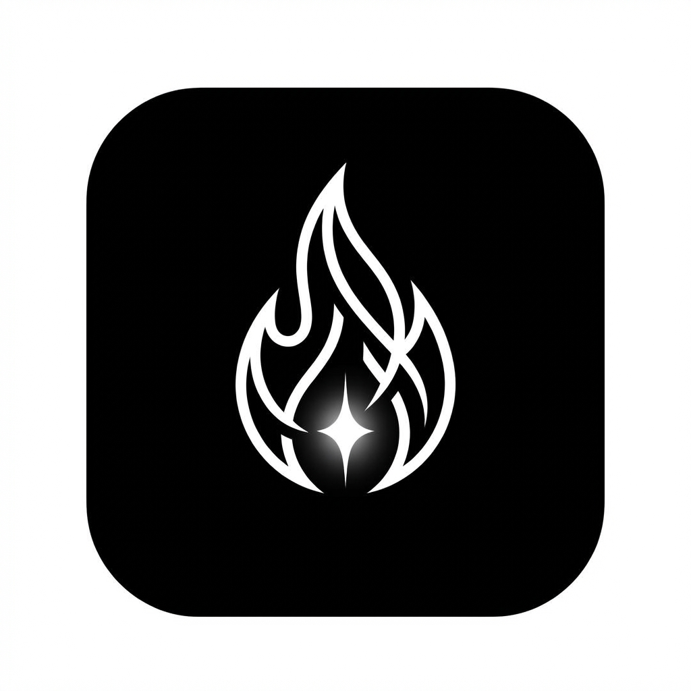

# Beyond - Comfort Zone Crusher

**Beyond** è una Progressive Web App (PWA) minimalista progettata per aiutarti a uscire dalla tua comfort zone, una sfida alla volta.

## Funzionalità
- **Monitoraggio Giornaliero**: Registra la tua sfida quotidiana.
- **Streak Counter**: Mantieni la striscia di giorni consecutivi per restare motivato (🔥).
- **Archivio Storico**: Rivedi tutte le tue sfide passate.
- **Privacy First**: Tutti i dati sono salvati localmente nel tuo browser (LocalStorage).
- **Backup**: Esporta i tuoi dati in formato JSON quando vuoi.
- **PWA**: Installabile su iOS e Android come un'app nativa.

## Installazione (iPhone/iPad)

1. Apri il sito in Safari.
2. Tocca il pulsante **Condividi** (quadrato con freccia in alto).
3. Seleziona **Aggiungi alla schermata Home**.
4. Tocca **Aggiungi**.
5. L'app apparirà sulla tua home screen e si aprirà a schermo intero.

## Sviluppo

Il progetto è strutturato in modo semplice:
- `index.html`: Struttura della pagina.
- `css/styles.css`: Stili e tema dark mode.
- `js/app.js`: Logica dell'applicazione.
- `assets/`: Icone e immagini.

## Crediti

Sviluppato per la crescita personale.
